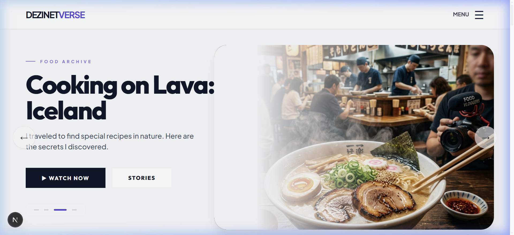
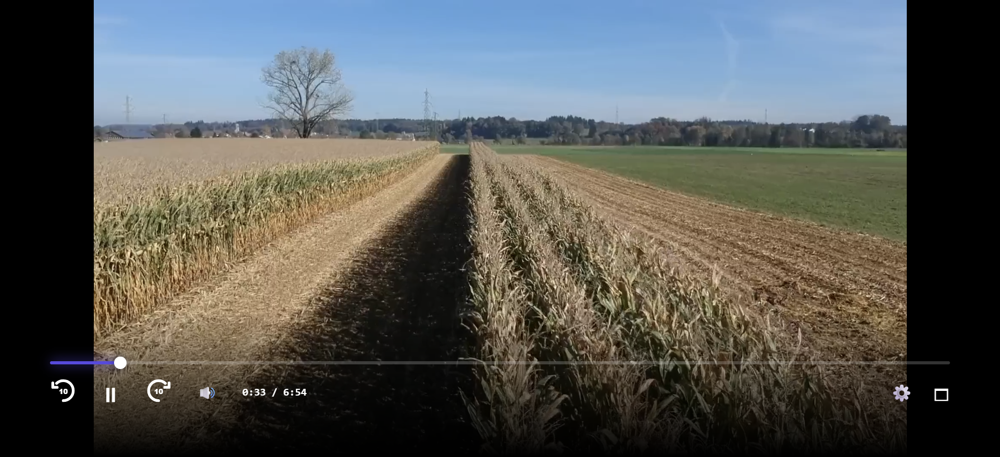

# 🎥 DezinetVerse - Premium Vlogging & OTT Frontend Template

[](LICENSE)
[](https://nextjs.org/)
[](https://www.typescriptlang.org/)
[](CONTRIBUTING.md)

DezinetVerse is a state-of-the-art, high-performance, and data-driven frontend template built for influencers, content creators, and OTT platforms. It provides a cinematic, "Netflix-grade" user experience right out of the box, optimized for speed, SEO, and visual excellence.

## 🖼️ Visual Experience

### Cinematic Hero Experience


### Series Collective & Full Chronicle


### Premium Content Gating


### Smart Monetization - Ad Insertion


### Immersive Full Screen Player


---

## 📖 Documentation Hub
We provide extensive documentation to help you scale and customize:
- 🏛️ [Architecture](doc/ARCHITECTURE.md) - System overview & Player logic.
- 🎨 [Design Guide](doc/THEME_GUIDE.md) - Theme tokens & UX principles.
- 🤝 [Contributing](doc/CONTRIBUTING.md) - How to help grow the project.
- 🗺️ [Roadmap](doc/ROADMAP.md) - Future releases and updates.
- 🔄 [Changelog](doc/CHANGELOG.md) - History of recent builds.

---

## 🔥 Key Features

*   **Premium Design System**: Built with modern typography (Outfit/Plus Jakarta), glassmorphism, and dynamic micro-animations.
*   **Data-Driven Architecture**: Manage your entire site (videos, series, creator bio) via simple JSON files without touching the code.
*   **Cinematic Video Player**: Custom-built player with 10s seek, volume controls, speed settings, and a built-in Ad-Insertion layer.
*   **Monetization Ready**: Dedicated sections for "Members Only" content, "Premium Tease," and "Sponsored Products."
*   **Responsive & Fast**: Fully optimized for mobile, tablet, and desktop using Next.js 16 (App Router) and Vanilla CSS.
*   **Dynamic Series Spotlight**: Beautiful horizontal scroll for long-form series and documentary sagas.

---

## 🛠️ Tech Stack

- **Framework**: [Next.js 16 (App Router)](https://nextjs.org/)
- **Logic**: [TypeScript](https://www.typescriptlang.org/) / [React 19](https://reactjs.org/)
- **Styling**: Vanilla CSS (Global Tokens + CSS Modules)
- **Icons**: Custom SVG Icons (High Visibility)
- **Deployment**: Optimized for one-click deployment to [Vercel](https://vercel.com/)

---

## 🚀 Getting Started

1.  **Clone the Repository**:
    ```bash
    git clone https://github.com/your-repo/vlogging-template.git
    cd vlogging-template/apps/web
    ```
2.  **Install Dependencies**:
    ```bash
    npm install
    ```
3.  **Run Development Server**:
    ```bash
    npm run dev
    ```
4.  **Open in Browser**:
    Visit [http://localhost:3000](http://localhost:3000)

---

## 📂 Customization (The "No-Code" Way)

You can customize the entire platform by editing the JSON files in `/app/data/`:

*   **`system.json`**: Update the creator name, avatar, bio, social links, and global categories.
*   **`series.json`**: Add or remove featured series/sagas with thumbnails and metadata.
*   **`video.json`**: Manage your entire video library, including "Premium" badges and series association.

---

## 🏗️ The Scaling Blueprint (Millions of Users)

To scale this frontend into a global platform like YouTube or Netflix, we recommend the following backend architecture:

### 1. **High-Concurrency Middleware**
- **Auth**: Stateless JWTs with **Valkey/Redis** for session management and refresh token blacklisting.
- **Compute**: **Go (Golang)** or **Node.js** microservices deployed on **Kubernetes (EKS/GKE)** with auto-scaling groups.

### 2. **Distributed Data**
- **Database**: **PostgreSQL** with Citus for horizontal scaling, or **ScyllaDB** for high-velocity view/watch-time metrics.
- **Cache**: Multiple **Valkey** nodes (leader-follower) to drastically reduce database load.

### 3. **Live Streaming & Real-time**
- **Ingest/Egress**: Use **SRS (Simple Realtime Server)** or **Ant Media** to handle low-latency RTMP ingest and LL-HLS delivery.
- **Multi-CDN**: Deliver video content via AWS CloudFront, Cloudflare, or Google Cloud CDN.
- **WebSockets**: Use **NATS** or **Redis Pub/Sub** backplane to sync live chat.

---

## 💰 Monetization & Ad Incorporation

The `CustomPlayer.tsx` is built to support two primary advertising models:

1.  **CSAI (Client-Side Ad Insertion)**: Integrate **Google IMA SDK** with the player logic.
2.  **SSAI (Server-Side Ad Insertion)**: Use AWS Elemental MediaTailor to stitch ads into the manifest.

---

## 🌩️ Static Hosting (Cloudflare Pages)

To host this project on Cloudflare Pages, use the following settings in your dashboard:

1.  **Framework Preset**: `None` (or `Static HTML`)
2.  **Build Command**: `npm run build`
3.  **Build Output Directory**: `out`
4.  **Deploy Command**: **Leave this EMPTY** ❗️ (Do not use `npx wrangler deploy` as it triggers worker migration).

---

## 📄 Licensing & Security

- **License**: [MIT License](LICENSE)
- **Code of Conduct**: [DezinetVerse CoC](CODE_OF_CONDUCT.md)
- **Security Policy**: [Report Vulnerabilities](SECURITY.md)
- **Support**: [Get Help](SUPPORT.md)

---

## 🤝 Contributing

Contributions are welcome! Please see our [Contributing Guide](doc/CONTRIBUTING.md) to get started.

1.  Fork the Project
2.  Create your Feature Branch (`git checkout -b feature/AmazingFeature`)
3.  Commit your Changes (`git commit -m 'Add some AmazingFeature'`)
4.  Push to the Branch (`git push origin feature/AmazingFeature`)
5.  Open a Pull Request
