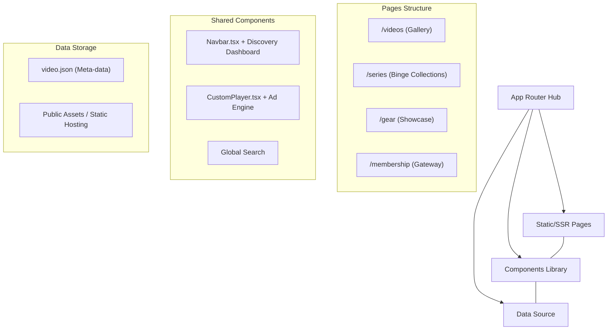
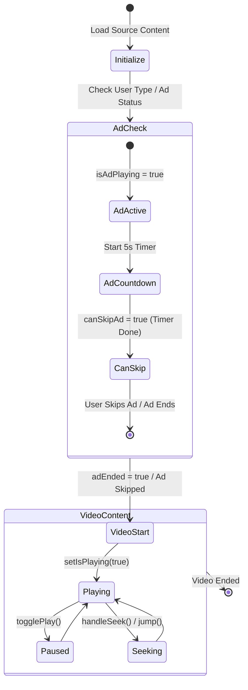
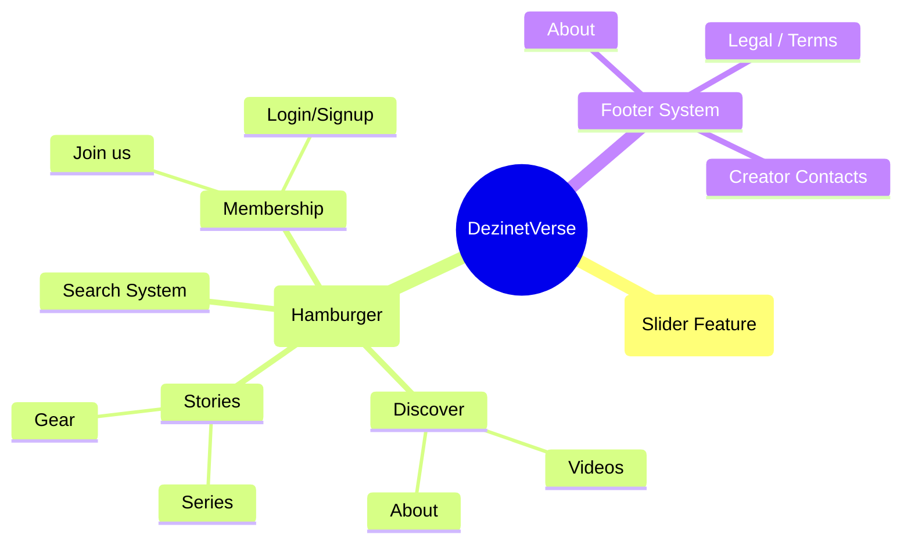
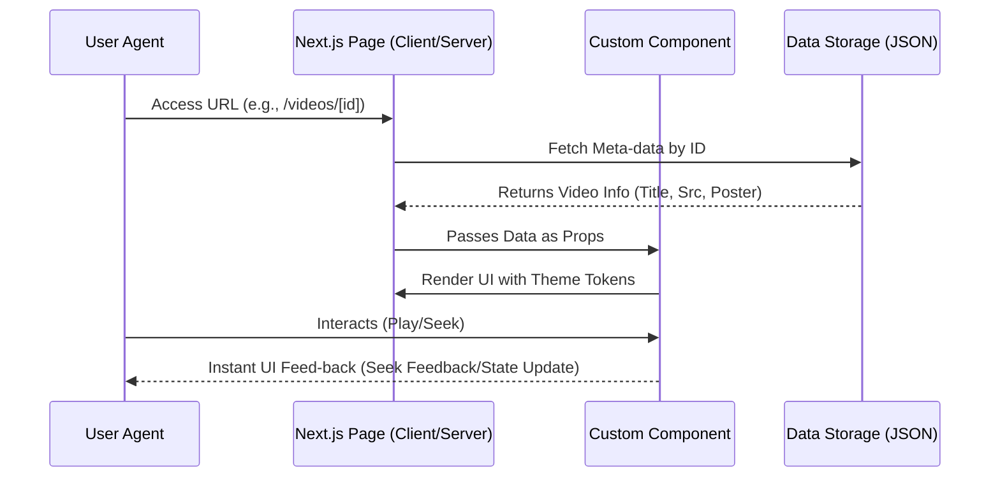

# 🏛️ Project Architecture

This document describes the high-level architecture of **DezinetVerse**, detailing the system structure and core workflows.

## 🧱 1. System High-Level Overview (Next.js 16)

DezinetVerse is built on **Next.js 16 (App Router)** with a focus on high-fidelity visual delivery. The architecture leverages Server-Side Rendering (SSR) for SEO-rich pages and Client-Side Hydration for immersive player interactions.

---

## 🎬 2. Video Player Logic & Ad Execution Flow

The player handles a sequential ad injection logic before playing the source content. Key features include keyboard shortcuts (`Space` to play, `F` for full-screen) and an integrated seek feedback system.

### 🧠 Core Player State:
-   **isAdPlaying:** Boolean flag that swaps the video source from the ad URL to the content URL.
-   **interactionNeeded:** Critical for browsers with autoplay blocks; forces a manual overlay click to begin playback.
-   **seekFeedback:** Temporary UI state to show `◀◀` or `▶▶` symbols on the screen.

---

## 🧭 3. Navigation Hierarchy (Discovery System)

The Discovery Dashboard is a full-screen React state-managed overlay (`Navbar.tsx`) that slides from top to bottom. It uses a `no-scrollbar` utility to ensure a cinematic feel.

---

## 📦 4. Data Flow Topology

