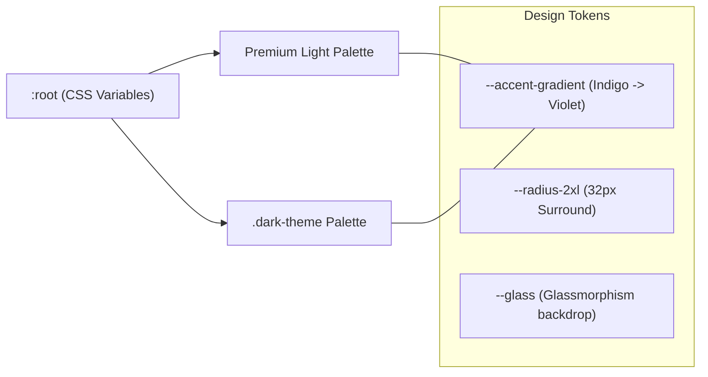
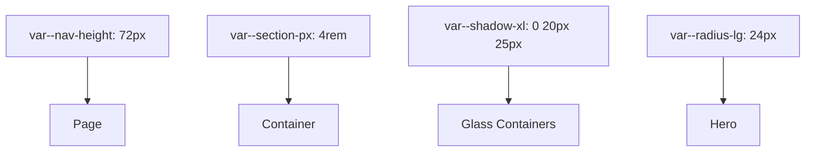

# 🎨 Theme Guide & Design Tokens

This guide defines the design tokens and visual hierarchy used in **Vlogging/OTT** to maintain its premium aesthetic.

## 🌈 1. Core Color Palettes

We use CSS variables in `globals.css` to allow for seamless theme switching and consistent branding.

### ☀️ Premium Light
-   `--bg-deep`: `#f8fafc` (The base canvas color)
-   `--bg-primary`: `#ffffff` (Card background)
-   `--accent-primary`: `#4f46e5` (Main Indigo)
-   `--accent-secondary`: `#7c3aed` (Violet accent)

### 🌙 Night Vision (Dark)
-   `--bg-deep`: `#050505` (Deep AMOLED black)
-   `--bg-primary`: `#0f172a` (Slate dark)
-   `--accent-primary`: `#4f46e5` (Consistent Branding)

## 💎 2. Visual Tokens

## 📐 3. Layout Token Relationships

## ✨ 4. UX Principles

1.  **Immersive First:** Every page should use large-scale visuals (video backgrounds, high-res posters).
2.  **Glassmorphism:** All overlays must use `backdrop-filter: blur(12px)` and have a semi-transparent border.
3.  **Smooth Transitions:** Use `cubic-bezier(0.19, 1, 0.22, 1)` for opening menus and sliders.
4.  **No-Scrollbar UI:** Overlays and sidebars should hide technical items like scrollbars to maintain the "Discovery Dashboard" feel.
